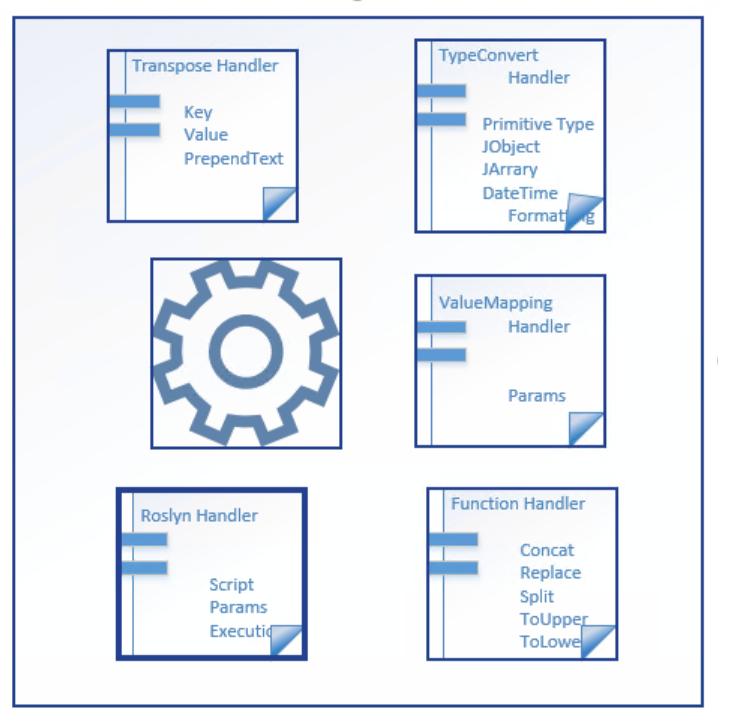

[](https://github.com/microsoft/JsonToJsonMapper/actions/workflows/dotnet-build-continuous.yml)
[](https://github.com/microsoft/JsonToJsonMapper/actions/workflows/dotnet-samples-build-continuous.yml)
[](https://coveralls.io/github/microsoft/JsonToJsonMapper?branch=main)

# JsonToJsonMapper 

AutoMapper works on JSON format to exchange information between systems. It enables transformation of data from one canonical schema to another and allows integration of different SaaS applications through orchestration. 
Following are some of the capabilities that Automapper currently supports:
1. Transformation from a flat type to flat/complex type.
2. Transformation from a complex type to flat/complex type.
3. Allows execution of CSharp script through Roslyn for complex transformation.
4. Supports JArray
5. Supports transformation of values from one datatype to another.
6. Data type validation


## Following are the handlers currently supported by the tool

**Transpose**
1. Key
2. Value
3. PrependText

**Type converter**
1. Primitive data types
2. JObject
3. Jarray
4. DateTime Formatting and Timezone
5. Nullable int, guid and decimal

**Roslyn Script**
1. Script
2. Params
3. Execution

**Value Mapping**
1. Params

**Function Handler**
1. Concatenation
2. Replace value
3. Split 
4. ToUpper
5. ToLower



### Example
Source Json
```json
{
  "result": [
    {
      "id": 2,
      "leadId": 6,
      "activityDate": "2013-09-26T06:56:35+0000",
      "activityTypeId": 12,
      "attributes": [
        {
          "name": "Source Type",
          "value": "Web page visit"
        },
        {
          "name": "Source Info",
          "value": "https://www.bing.com/"
        }
      ]
    }
  ]
}
```
Expeced output
```javascript
{
  "Content": [
    {
      "leadId": 6,
      "Source Type": "Web page visit",
      "Source Info": "https://www.bing.com/"
    }
  ]
}
```

Mapping config
```javascript
{
  "MappingRuleConfig": {
      "TruthTable": [
          {
              "DestinationColumn": "ContentJSON",
              "ComplexType": {
                  "DataType": "JArray",
                  "Node": "$.result[*]",
                  "TruthTable": [
                  {
                       "SourceColumn": "$.leadId",
                       "DestinationColumn": "leadId",
                       "DataType": "long"
                   },
                   {
                       "SourceColumn": "$.attributes[*]",
                       "DataType": "JArray",
                       "TransformValue": {
                             "Type": "PromoteArrayToProperty",
                             "KeyLookupField": "$.name",
                             "ValueLookupField": "$.value"
                              }
                   }
               ]
           }
       ]
   }
}
```

## Contributing

This project welcomes contributions and suggestions.  Most contributions require you to agree to a
Contributor License Agreement (CLA) declaring that you have the right to, and actually do, grant us
the rights to use your contribution. For details, visit https://cla.opensource.microsoft.com.

When you submit a pull request, a CLA bot will automatically determine whether you need to provide
a CLA and decorate the PR appropriately (e.g., status check, comment). Simply follow the instructions
provided by the bot. You will only need to do this once across all repos using our CLA.

This project has adopted the [Microsoft Open Source Code of Conduct](https://opensource.microsoft.com/codeofconduct/).
For more information see the [Code of Conduct FAQ](https://opensource.microsoft.com/codeofconduct/faq/) or
contact [opencode@microsoft.com](mailto:opencode@microsoft.com) with any additional questions or comments.


## Code of Conduct

This project has adopted the [Microsoft Open Source Code of Conduct](https://opensource.microsoft.com/codeofconduct/). For more information see the [Code of Conduct FAQ](https://opensource.microsoft.com/codeofconduct/faq/) or contact [opencode@microsoft.com](mailto:opencode@microsoft.com) with any additional questions or comments.


## Trademarks

This project may contain trademarks or logos for projects, products, or services. Authorized use of Microsoft 
trademarks or logos is subject to and must follow 
[Microsoft's Trademark & Brand Guidelines](https://www.microsoft.com/en-us/legal/intellectualproperty/trademarks/usage/general).
Use of Microsoft trademarks or logos in modified versions of this project must not cause confusion or imply Microsoft sponsorship.
Any use of third-party trademarks or logos are subject to those third-party's policies.
